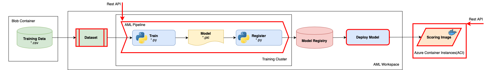

# Challenge 3: Orchestrate ML Operationalization with a Pipeline

In Challenge 2, you transformed the experimental notebook into a script that can be managed and run independently of the notebook. You used the script to train the model, then you used code in the notebook to register the model that the script produced.

In this challenge, we provide you with scripts for model training, model registration, and model scoring. Using the provided model training and registration scripts, you'll encapsulate both model training and model registration into an Azure ML pipeline that breaks the tasks down into a sequence of steps that can be run on-demand or automatically. Running training with a full set of data can take a very long time on a typical workstation, but you don't want to invest in expensive hardware that will only be used periodically. To resolve this, your pipeline will be configured to run on an Azure Machine Learning cluster that is provisioned and scaled automatically when needed.

You'll also deploy the registered model as a real-time inferencing service using the provided model scoring script, so it can be *consumed* by an insurance application approval application.

## Recommended Reading

* [Documentation - What are Azure Machine Learning pipelines?](https://docs.microsoft.com/azure/machine-learning/concept-ml-pipelines)
* [Documentation - How to create your first Azure ML Pipeline](https://docs.microsoft.com/azure/machine-learning/how-to-create-your-first-pipeline)
* [Documentation - How to debug and troubleshoot machine learning pipelines](https://docs.microsoft.com/azure/machine-learning/how-to-debug-pipelines)

## Challenge

### Part 1: Create an Azure ML Pipeline

As a team, create an Azure ML pipeline that trains and registers the model. The pipeline should run on a training cluster compute target in your Azure ML workspace.

Prepare your Azure ML workspace with the following steps:

1. Create an Azure ML compute target on which to run the pipeline and its steps.
    * To avoid automatic scale down of Azure ML managed compute, edit the training compute options and set **Idle seconds before scale down** to 1800 or more. This can save time between pipeline runs if you are frequently debugging AML pipelines.
    * [Documentation - What are compute targets in Azure Machine Learning?](https://docs.microsoft.com/azure/machine-learning/concept-compute-target)

2. Create and register a **Dataset** for the driver insurance training data.
    * By using a **Dataset**, your training script can read it from a central **Datastore** in the workspace regardless of the compute target on which it is run.
    * [Documentation - Data access in Azure Machine Learning](https://docs.microsoft.com/azure/machine-learning/concept-data)

Now that your workspace is prepared, create a new notebook and write code to complete the following tasks. Use the [Creating an Azure Machine Learning Pipeline](https://github.com/MicrosoftDocs/mslearn-aml-labs/blob/master/05-Creating_a_Pipeline.ipynb) notebook as a starting point for the code.

1. Use a **PipelineData** object to pass the *output* of the training step (the trained model) to the *input* of the model registration step. This creates a dependency between the steps.
    * In addition to defining *inputs* and *outputs* for the steps, both scripts will require an *argument* for this object. The *argument* will define the virtual path to the folder where the model file will be saved by the first step and loaded by the second step. In previous challenges, this was hard-coded to be the *output* folder.

2. Define the steps for your pipeline - these should be an **EstimatorStep** for the training script, and a **PythonScriptStep** for the model registration step.
    * Train the model using an Estimator and the provided training script.
    * Register the model with the name **lgbm_binary_model.pkl** using the provided registration script.

3. Run the pipeline and verify that it has trained and registered the model.

4. Publish the pipeline and initiate it from its endpoint.

### Part 2: Deploy an Inferencing Service

As a team, deploy the model that was trained and registered by your Azure ML Pipeline.

Use the [Creating a Real-Time Inferencing Service](https://github.com/MicrosoftDocs/mslearn-aml-labs/blob/master/06-Deploying_a_model.ipynb) notebook as a starting point for the code to deploy the model.

1. Adapt the code in the sample notebook to:

    * Retrieve the most recent version of the registered insurance claim prediction model.
    * Create a *Conda dependencies* file that includes the Python packages required by your scoring script.
    * Use the *scoring script* provided in the **Challenge03** folder of the OpenHack files. This includes an **init** function that loads the registered model, and a **run** function that uses it to predict claim classifications for new driver data.

2. Run the code in a notebook to retrieve the registered model and deploy it as an inferencing service to an Azure Container Instance (ACI).
    * Deploy the insurance claim prediction model as an ACI service, with the scoring script and conda dependencies you defined previously.
    * Check for the ACI container logs if service deployment takes longer than expected.

    [Documentation - How to deploy models with Azure Machine Learning](https://docs.microsoft.com/azure/machine-learning/how-to-deploy-and-where)

    [*Microsoft Learn* module - Deploying machine learning models with Azure Machine Learning](https://docs.microsoft.com/learn/modules/register-and-deploy-model-with-amls/index)

3. Test the deployed service by submitting a REST request to its endpoint abd review the predictions it returns.
    * Use the following test data in numpy array format. This represents details for two drivers, for which your service should predict the likelihood of an insurance claim.

    ```Python
    [[0,1,8,1,0,0,1,0,0,0,0,0,0,0,12,1,0,0,0.5,0.3,0.610327781,7,1,-1,0,-1,1,1,1,2,1,65,1,0.316227766,0.669556409,0.352136337,3.464101615,0.1,0.8,0.6,1,1,6,3,6,2,9,1,1,1,12,0,1,1,0,0,1],
    [4,2,5,1,0,0,0,0,1,0,0,0,0,0,5,1,0,0,0.9,0.5,0.771362431,4,1,-1,0,0,11,1,1,0,1,103,1,0.316227766,0.60632002,0.358329457,2.828427125,0.4,0.5,0.4,3,3,8,4,10,2,7,2,0,3,10,0,0,1,1,0,1]]
    ```



### Success Criteria

To complete this challenge, you must:

* Successfully run your Azure ML pipeline by initiating it from its endpoint.
* Successfully deploy the trained model as a service and test its endpoint.
* Discuss the following questions with your coach:
    * What are the benefits of splitting the ML process into steps?
    * What are the benefits of publishing an Azure ML pipeline as a REST service?
    * What other steps might you include in a training pipeline?
